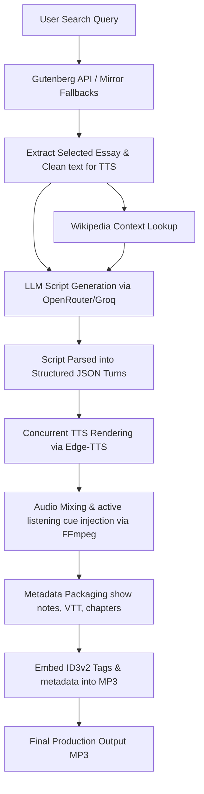

# 🎙️ Automated Classical Essay Podcast Generator

[](https://www.python.org/)
[](LICENSE)
[](https://github.com/rany2/edge-tts)
[](https://ffmpeg.org/)

This repository provides a highly optimized, automated command-line pipeline designed to search, extract, and convert classical essays and philosophical treatises from Project Gutenberg into fully produced, professional podcasts. 

Featuring two customizable intellectual AI co-hosts, the generated show simulates an engaging, organic peer-to-peer discussion—complete with background music, dynamic audio pacing, active listening cues, and standard ID3 metadata.

---

## 🏗️ Architecture & Pipeline Workflow

The flowchart below demonstrates the execution path from initial user search query to the final mastered MP3 output:



---

## ✨ Features

- 📚 **Robust Gutenberg Integration**: Search and extract text/HTML format essays directly from Project Gutenberg using the Gutendex API. Includes a smart fallback layer that uses numeric ID detection on timeout to bypass redundant prompts and scrape files directly via four distinct mirror networks.
- 🧹 **TTS-Ready Text Cleaning**: Automatically cleans raw Gutenberg text files by trimming licensing boilerplate, reconstructing line-wrap hyphenations, and normalizing white space for optimal speech rendering.
- 🔍 **Wikipedia Historical Context**: Programmatically fetches biographical summaries and historical reception context about the author and subject to feed the podcast's introduction.
- 🤖 **Co-Host Debate Archetype**: Generates a natural dialogue between intellectual equals using OpenRouter or Groq. The first co-host focuses on history and biography while the second co-host targets textual philosophy. Turns are balanced, avoiding rigid Q&A monologues, and direct name-calling is capped to a natural minimum (at most 3-4 times per segment).
- 🎙️ **Concurrent Text-to-Speech (TTS)**: Translates script turns into voice concurrently using Microsoft Edge TTS, applying phonetic pronunciation corrections for difficult philosopher names (e.g., Nietzsche, Schopenhauer) and speed/pitch adjustments based on the host's tone (reflective, excited, serious).
- 🎵 **Studio-Grade Audio Mixing**: Uses FFmpeg to mix vocal tracks with background music, adjust volume levels, inject realistic listener cues (like *mhm*, *yeah*, *right*), and stitch everything together.
- 📝 **Automatic Metadata & SEO Package**: Generates Spotify-ready title, SEO description, tags, interactive chapter markers, a WebVTT transcript, and embeds ID3 tags directly into the final MP3 file.

---

## 📁 Repository Structure

```text
Project_Gutenberg_Extractor_CLI/
├── assets/                  # Contains intro/outro themes and active listening sound clips
│   ├── active_listening/    # "mhm.mp3", "yeah.mp3", etc.
│   └── music/               # Intro/outro backing tracks
├── output/                  # Raw pre-processed essay texts extracted from Gutenberg
├── podcast_output/          # Generated podcasts (categorized in timestamped folders)
│   └── [episode_folders]/   # Contain final MP3, VTT transcripts, show notes, and chapter files
├── temp/                    # Temp directory for caching individual TTS speech segments
├── .env                     # Local API keys and customizable configurations (ignored by git)
├── .gitignore               # Configured to protect API keys, virtual environment, and large media files
├── analyze_wordcounts.py    # Script helper to analyze vocabulary/word distributions
├── audio_generator.py       # Interacts with Edge-TTS to render audio segments
├── extractor.py             # CLI Search, Gutenberg extraction, Wikipedia lookups, and orchestrator
├── metadata_generator.py    # Generates chapter markers, show notes, and WebVTT transcripts
├── mixer.py                 # Mixes speech segments, active listening audio, and background music
├── podcast_generator.py     # Orchestrates the podcast generation stages (script, audio, mix, meta)
├── requirements.txt         # Python project dependencies
├── script_generator.py      # Connects to LLMs via OpenRouter/Groq to generate the script
├── test_pronunciation.py    # Unit helper to check phonetic pronunciation modifications
├── usage_tracker.py         # Logs API usage, tokens consumed, and session diagnostics
└── voices.txt               # Catalog of available Microsoft Edge TTS neural voices
```

---

## 🚀 Installation & Setup

### Prerequisites
- **Python 3.10+**
- **FFmpeg**: Make sure `ffmpeg` is installed and added to your system's PATH. (Required for mixing audio files).

### Installation Steps
1. Clone the repository:
   ```bash
   git clone https://github.com/kvothdevian/Podcastmaker.git
   cd Podcastmaker
   ```
2. Set up a Python Virtual Environment:
   ```bash
   python -m venv venv
   # On Windows:
   venv\Scripts\activate
   # On macOS/Linux:
   source venv/bin/activate
   ```
3. Install dependencies:
   ```bash
   pip install -r requirements.txt
   ```
4. Configure Environment Variables:
   Create a `.env` file in the root directory to store your API credentials and customize your podcast settings:
   ```env
   # API Keys
   OPENROUTER_API_KEY=your_openrouter_key
   GROQ_API_KEY=your_groq_key

   # Podcast Customization
   PODCAST_NAME=My Podcast Name
   PODCAST_INTRO_TEXT=Welcome to My Podcast, where we discuss classic literature.
   USER_AGENT_EMAIL=contact@example.com
   USER_AGENT_SITE=https://example.com

   # Host Customization
   HOST_1_NAME=HostOne
   HOST_2_NAME=HostTwo

   # Voice Customizations (using Edge-TTS voices)
   HOST_VOICE=en-US-BrianNeural
   NARRATOR_VOICE=en-US-AndrewNeural

   # Theme Music (optional paths, relative to root)
   INTRO_MUSIC_PATH=assets/music/intro_theme.mp3
   OUTRO_MUSIC_PATH=assets/music/outro_theme.mp3
   ```

---

## 📖 Usage Guide

The project is designed to run seamlessly from start to finish via `extractor.py`.

### 1. Run the Full Pipeline
To start searching, extracting, and rendering a podcast:
```bash
python extractor.py
```
This interactive prompt will:
1. Search Project Gutenberg for your author, book, or keyword.
2. Let you select from the top 10 book matches.
3. Automatically split the book and display a list of chapters/essays.
4. Download the chosen chapter, clean the text, lookup Wikipedia context, and automatically invoke the podcast creation pipeline.

### 2. Run Only the Podcast Generator (On Local Texts)
If you already have a text file preprocessed and saved, you can run the podcast pipeline directly on that file:
```bash
python podcast_generator.py path/to/essay.txt --title "My Custom Essay" --author "Author Name" --episode 1
```

---

## 🔒 Security Notes
- The `.env` file, python virtual environment (`venv/`), raw output directories, and temporary audio render folders are listed in `.gitignore` to prevent any API keys, credentials, or heavy audio assets from being uploaded to GitHub.
- Secret keys can be stored securely in **GitHub Actions Secrets** (using the names `OPENROUTER_API_KEY` and `GROQ_API_KEY`) if running automated tasks on the cloud.